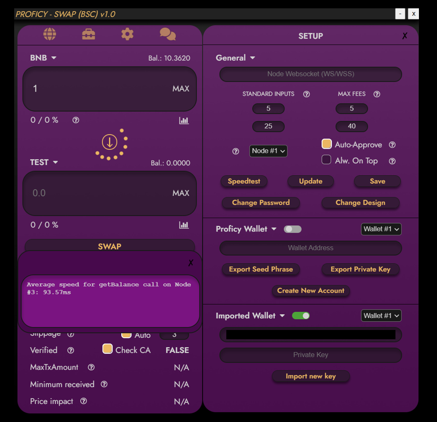

# ProficySwap Guide

## DISCLAIMER  
PROFICY is not liable for any loss of funds through the use of the swap. This includes every possible scenario (e.g., bad trading habits, a user being victim of a cyber attack, servers being attacked, buying cryptocurrencies run by malicious developers, etc.)  

We explcitly recommend **NOT TO USE YOUR MAIN WALLET** for our swap. This is common practice with these kind of products and should always be kept this way.  

We at PROFICY took every available measure to prevent any malicious activity could happen on our end by encrypting private keys and keeping our nodes secure.  

## TABLE OF CONTENTS
[**SWAP**](#swap)  
[**SETTINGS**](#settings)  
[**ADVANCED USAGE**](#advanced-usage)  
[**CHANGELOG**](#changelog)  

## SWAP  

  

1.	**Chain Selection**: Easily switch between chains by clicking on these icons. BSC is currently supported, but ETH, AVAX, and FTM are actively in development and will be added soon.
2.	**Swap Setup** Click this icon to open the [SETUP](#setup) window.
3.	**Tracker (COMING SOON)**: This button opens the Proficy Token Tracker. This will allow you to view current token holdings accumulated through use of ProficySwap, with features like sell initial at X, automatically sell at X, stop-loss, and manually selling a percentage of holdings. [Click here](https://www.proficy.io/whitepaper.pdf#page=5) for more info.
4.	**Antirug (COMING SOON)** Proven to be effective in [proficy.io](https://www.proficy.io) applications, when enabled, Proficy Antirug will automatically frontrun malicious activity from devs like pulling liquidity or changing max transaction amounts and sells before these changes can take effect.
5.	**Data (COMING SOON)** Click this button to view supplemental information like the Proficy Token Analyzer to view token-related information and charts. [Click here](https://www.proficy.io/whitepaper.pdf#page=5) for more info.
6.	**Tax Info**: Buy Tax / Sell Tax for each token displayed. This info updates in real time so you can easily watch and buy or sell if taxes are lowered.
7. **General Swap Info**: Standard swap information is displayed here such as balance and price updates of the tokens selected. Click on the token symbol to choose a new token. Click on the chart icons to open DEX Screener charts for the selected token. Clicking the SWAP button will immediately send a transaction through a Proficy private node (or your own private node if you choose) immediately without the need for confirmation. This means a transaction should go through immediately without having to confirm and wait like you have to do in other swaps.
8. **Swap Settings**: ProficySwap offers the following customized settings:  
- **SafeBuy**: If checked, [SafeBuy](#safebuy) will automatically protect you from buying honeypots, antibot, or high tax tokens. 
- **Bypass maxTx**: If this is checked, the swap will bypass maxTxAmount and do multiple buy/sell calls in one single Tx (be aware, every call costs gas).
- **Gas Price**: Easily change your gas price (gwei) here without having to click through multiple windows like you would have to in MetaMask. 
9. **Swap Info**: The following swap information is displayed here:
- **Route**: The best possible route that results in the most tokens received.
- **Slippage**: Price change you are willing to accept while your Tx is processed.
- **Verified**: If checked, ProficySwap will automatically check if the "to" (bottom) token is verified on the chain explorer (e.g., BscScan or Etherscan). If the scan website is slow or under mainteance, uncheck this checkbox (be aware, bypassing maxTx is not possible then).
- **MaxTxAmount**: The maximum amount of tokens that can be bought/sold on the "to" token. 
- **Minimum received**: The minimum amount you receive/maximum amount you spend, if slippage is fully used. 
- **Price impact**: The price impact your Tx will have on the liquidity pool of the "to" token.

## SETUP

  
1. **Wallet and Private Key Inputs**: Enter your wallet and private key here. You can input your private key only and ProficySwap will automatically detect your wallet address. Your private key will be encrypted and safely stored locally on your computer. Note that your private key is different from your seed phrase. Follow these instructions to export your private key for use in the ProficySwap app: https://metamask.zendesk.com/hc/en-us/articles/360015289632-How-to-Export-an-Account-Private-Key.
2. **Custom Websocket URL**: If you host your own private node, enter the websocket URL here. Otherwise leave this blank and use a Proficy hosted private node.
3. **Standard Inputs**: Standard inputs the app will load on startup. Top input is gwei and bottom input is slippage.
4. **Max Fees**: The maximum txFees you are willing to accept on a trade if SafeBuy is active. Top input is buy fee and bottom input is sell fee.  
5. **Node Selection**: Choose a Proficy node or select your own node in this dropdown.
6. **Auto-Approve**: If auto-approve is active, it will silently approve a token you just bought.  
7. **Speedtest**: The [SPEEDTEST](#speedtest) will find the best endpoint for you.
8. **Save**: Save your inputs here. Wallet and Private Key are the only required inputs.
9. **Update**: Check to see if you have the most recent version of ProficySwap and automatically download the latest version if not. 

## ADVANCED USAGE
The following features are examples of advanced ways to use ProficySwap.
### Manual Sniper
  
If you want to buy a launch and be one of the first to buy when liquidity is added or antibot measures are finished, you can put that token in the bottom "to" token and wait until the warning disappears. ProficySwap will automatically check every block until trading is enabled and it's safe to buy. 

### SafeBuy
  
In this example, the maximum buy fee is set to 5% in the settings tab on the right. After clicking swap, SafeBuy protects from buying since the selected token has a buy tax of 10%. This feature protects you from buying high tax tokens, honeypots, and tokens that have antibot measures in place. 

### Speedtest
  
Clicking the SPEEDTEST button in SETUP will automatically test all Proficy private nodes and your own node if available and automatically select the fastest node for you. This ensures you have the fastest transaction speeds and swap updates. Using Proficy private nodes means you will have an advantage when networks are congested and others are relying on public RPC nodes.

## CHANGELOG
ProficySwap bugfixes, enhancements, and new features will be posted here. 

