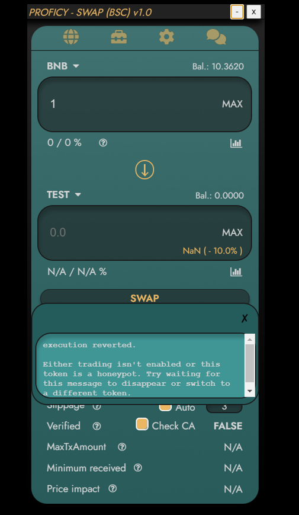
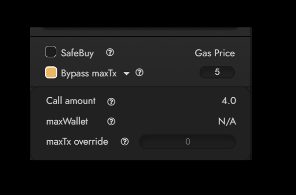

# ProficySwap Guide

## DISCLAIMER  
PROFICY is not liable for any loss of funds through the use of the swap. This includes every possible scenario (e.g., bad trading habits, a user being victim of a cyber attack, servers being attacked, buying cryptocurrencies run by malicious developers, etc.)  

We explcitly recommend **NOT TO USE YOUR MAIN WALLET** for our swap. This is common practice with these kind of products and should always be kept this way.  

We at PROFICY took every available measure to prevent any malicious activity could happen on our end by encrypting private keys and keeping our nodes secure.  

## TABLE OF CONTENTS
[**SWAP**](#swap)  
[**SETTINGS**](#settings)  
[**SUPPLEMENTAL TOOLS**](#supplemental-tools)  
[**ADVANCED USAGE**](#advanced-usage)  
[**CHANGELOG**](#changelog)  

## SWAP  

  

1.	**Chain Selection**: Easily switch between chains by clicking on these icons. BSC is currently supported, but ETH, AVAX, and FTM are actively in development and will be added soon.
2. [**Supplemental Tools**](#supplemental-tools): Proficy offers the following supplemental tools included with the swap:
- [**Portfolio**](#portfolio): View your entire portfolio with the ability to favorite, delete, filter out honeypots, and a "sell dust" feature to sell all tokens within a given range. 
- [**Transfer**](#transfer): Transfer your tokens to external wallets or between newly created wallets in ProficySwap.
- [**Token Data**](#token-data): View token info such as holders, market cap, liquidity lock information, user trades, and top holders.
- **Charts** (Coming soon): view token charts directly in ProficySwap.
3.	**Swap Setup** Click this icon to open the [SETUP](#setup) window.
4.	**Socials**: Learn more about Proficy at https://proficy.io or join us on the following platforms:  
- Telegram: https://t.me/ProficyNetworkPortal
- Discord: https://discord.gg/Ske27Qnmmn 
5.	**Tax Info**: Buy Tax / Sell Tax for each token displayed. This info updates in real time so you can easily watch and buy or sell if taxes are lowered. Note: you must have an amount in the input for the tax to update automatically.
6. **General Swap Info**: Standard swap information is displayed here such as balance and price updates of the tokens selected. Click on the token symbol to choose a new token. Click on the chart icons to open DEX Screener charts for the selected token. Clicking the SWAP button will immediately send a transaction through a Proficy private node (or your own private node if you choose) immediately without the need for confirmation. This means a transaction should go through immediately without having to confirm and wait like you have to do in other swaps.
7. **Swap Settings**: ProficySwap offers the following customized settings:  
- **SafeBuy**: If checked, [SafeBuy](#safebuy) will automatically protect you from buying honeypots, antibot, or high tax tokens. 
- **Bypass maxTx**: If this is checked, the swap will bypass maxTxAmount and do multiple buy/sell calls in one single Tx (be aware, every call costs gas).
- **Gas Price**: Easily change your gas price (gwei) here without having to click through multiple windows like you would have to in MetaMask. 
8. **Swap Info**: The following swap information is displayed here:
- **Route**: The best possible route that results in the most tokens received.
- **Slippage**: Price change you are willing to accept while your Tx is processed.
- **Verified**: If checked, ProficySwap will automatically check if the "to" (bottom) token is verified on the chain explorer (e.g., BscScan or Etherscan). If the scan website is slow or under mainteance, uncheck this checkbox (be aware, bypassing maxTx is not possible then).
- **MaxTxAmount**: The maximum amount of tokens that can be bought/sold on the "to" token. 
- **Minimum received**: The minimum amount you receive/maximum amount you spend, if slippage is fully used. 
- **Price impact**: The price impact your Tx will have on the liquidity pool of the "to" token.

## SETUP

  
1. **Custom Websocket URL**: If you host your own private node, enter the websocket URL here. Otherwise leave this blank and use a Proficy hosted private node.
2. **Standard Inputs**: Standard inputs the app will load on startup. Top input is gwei and bottom input is slippage.
3. **Max Fees**: The maximum txFees you are willing to accept on a trade if SafeBuy is active. Top input is buy fee and bottom input is sell fee.  
4. **Node Selection**: Choose one of Proficy node's hosted around the globe or select your own node in this dropdown.
5.  **Auto-Approve/Always on Top**: If auto-approve is active, it will silently approve a token you just bought which will allow you to immediately sell if needed. Always On Top will allow you to keep ProficySwap pinned to the top so you can always have the swap open while you're viewing charts or browsing the web.
6. **Settings Buttons**
- **Speedtest**: The [SPEEDTEST](#speedtest) will find the best endpoint for you.
- **Update**: Click this to see if your current version of ProficySwap is up-to-date. If not, the latest version will automatically start downloading to your default Downloads folder.
- **Save**: Save your current swap settings.
- **Change Password**: Change your current password that is used to logged into the app. It will be automatically encrypted.  
- [**Change Design**](#change-design): Configure your background colors to anything you desire.  
7. **Proficy Wallet**: Create a new wallet with the ability to export the seed phrase and private key.
8. **Imported Wallet**: Import a wallet here. You can input your private key only and ProficySwap will automatically detect your wallet address. Your private key will be encrypted and safely stored locally on your computer. Note that your private key is different from your seed phrase. Follow these instructions to export your private key for use in the ProficySwap app: https://metamask.zendesk.com/hc/en-us/articles/360015289632-How-to-Export-an-Account-Private-Key.

## SUPPLEMENTAL TOOLS  
[**Portfolio**](#portfolio)  
[**Transfer**](#transfer)  
[**Token Data**](#token-data)  
[**Search**](#search)
### Portfolio  
  
1. View your current portfolio and balances with worth of tokens in USD. Click the headers to sort by token name, highest or lowest balances, or favorite tokens.
2. Click these buttons to view your overall portfolio, refresh your tokens with updated balanaces, view favorites, and view deleted tokens.
3. Set a lower and upper limit in USD to filter your portfolio by.
4. Click this button to ["Sell Dust"](#sell-dust), which will allow you to immediately sell all tokens within the given lower and upper limits.
5. Filter your tokens by range, [filter honeypots](#filter-honeypots), or delete all within the given range.
### Transfer  
  
Easily transfer your tokens to external wallets or newly created Proficy wallets. Your entire filtered portfolio is displayed. Click on the arrow next to select which token to transfer. ProficySwap will calculate optimal gas prices and limits if possible. Enter the wallet to transfer to and the token amount and click send to complete the transfer.

### Token Data  
  
1. **General**: View general information about the token. Click the contract address or contract owner address to view additional information on BscScan.
2. **Liquidity**: View liquidity information and current worth of liquidity pairs in USD. ProficySwap also displays where liquidity is locked and for how long it's locked if available. If liquidity locks are not displayed, double check the liquidity pair holders list in BscScan to make sure.
3. **User Trades**: View your most recent trades on the selected token.
4. **Top Holders**: View the top holders and percentage of supply owned.
### Search  
  
ProficySwap offers the fastest token search available. Click on a token symbol from the main swap view to open token search and search by token name, symbol, or contract address. The tokens with the highest amounts of liquidity are displayed first. This information is updated in real time with new tokens and updated liquidity amounts. Only tokens with greater than $1000 in liquidity are displayed. Click on Name, Date, or Liquidity to filter on these items.

## ADVANCED USAGE
[**Manual Sniper**](#manual-sniper)  
[**SafeBuy**](#safebuy)  
[**Bypass maxTx**](#bypass-maxtx)
[**Sell Dust**](#sell-dust)
[**Speedtest**](#speedtest)
[**Change Design**](#change-design)  
### Manual Sniper
  
If you want to buy a launch and be one of the first to buy when liquidity is added or antibot measures are finished, you can put that token in the bottom "to" token and wait until the warning disappears. ProficySwap will automatically check every block until trading is enabled and it's safe to buy. Note: you must have an input in the top token for it to scan for liquidity being added.

### SafeBuy
  
In this example, the maximum buy fee is set to 5% in the settings tab on the right. After clicking swap, SafeBuy protects from buying since the selected token has a buy tax of 10%. This feature protects you from buying high tax tokens, honeypots, and tokens that have antibot measures in place. 

### Bypass maxTx
  
Many tokens restrict buyers directly after launch by setting low maximum transaction amounts. ProficySwap allows you to bypass these limits by using a custom smart contract to make multiple transactions in one. Click on the dropdown next to the Bypass maxTx to view how many calls will be made in a single transaction or override this value yourself. Be aware that every call costs gas so your transaction fees will be higher than normal.
### Sell Dust
  
To sell your dust, select a lower and upper range and click the Sell Dust button. Note: it's better to filter out honeypots before selling your dust.  
   
After clicking Sell Dust, ProficySwap will simulate a buy and sell on each of the filtered tokens to see if the transaction would succeed or if it's worth the cost of gas to sell the tokens. Select all tokens and click Delete to move them to your deleted list.
  
Confirm that you would like to sell all the tokens displayed or unselect any tokens you'd like to keep.   
   
ProficySwap will sell all selected dust tokens at once, displaying if each transaction succeeded or failed and the total recovered amount. In this example, 1.65 BNB was recovered from selling dust tokens.  
   
If you check your wallet in BscScan, you can see that all tokens were sold within seconds.
### Speedtest
  
Clicking the SPEEDTEST button in SETUP will automatically test all Proficy private nodes and your own node if available and automatically select the fastest node for you. This ensures you have the fastest transaction speeds and swap updates. Using Proficy private nodes means you will have an advantage when networks are congested and others are relying on public RPC nodes.
### Change Design
  
The design of ProficySwap is highly customizable. Click the Change Design button in your settings to choose any color you desire.
## CHANGELOG
ProficySwap bugfixes, enhancements, and new features will be posted here. 

